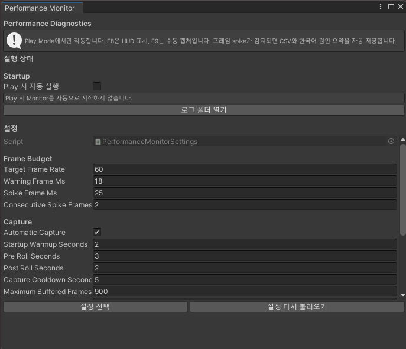
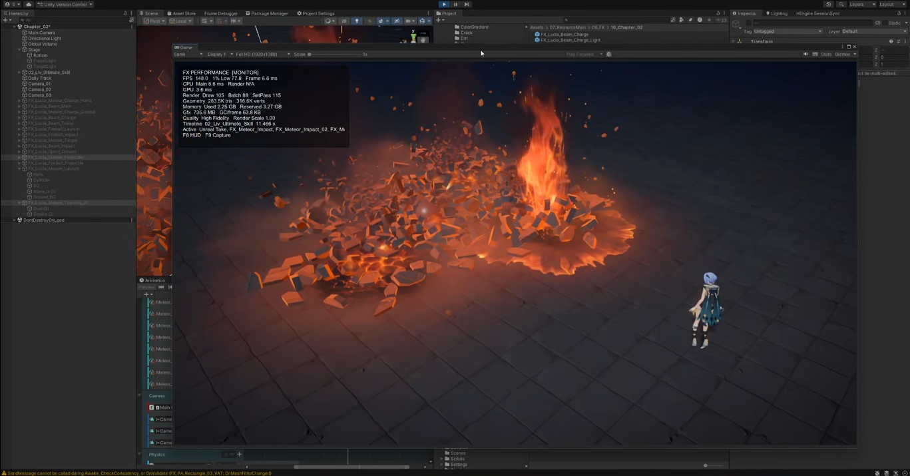

# Performance Monitor

Unity Play Mode와 Development Build에서 FX 및 Timeline의 프레임 성능을 기록하는 진단 도구입니다.

## 주요 기능

- CPU, GPU, Draw Call, 메모리 사용량을 HUD로 확인
- 설정한 프레임 임계값을 넘으면 자동 캡처
- Timeline과 활성 Clip을 기준으로 부하 후보 분석
- 프레임별 CSV와 요약 텍스트 저장

## 사용법

1. `Tools > RoofTop Studio > Performance Monitor`를 엽니다.
2. 설정 에셋이 없다면 `기본 설정 에셋 생성`을 누릅니다.
3. Play Mode에서 측정할 Timeline 또는 FX를 재생합니다.
4. `F8`로 HUD를 켜거나 끄고, `F9`로 즉시 캡처합니다.
5. `로그 폴더 열기`에서 CSV와 `_summary.txt`를 확인합니다.

로그는 `Application.persistentDataPath/PerformanceMonitor`에 저장됩니다. 자동 캡처 기준과 저장 폴더명은 설정 에셋에서 변경할 수 있습니다.

## 참고

- Edit Mode와 Timeline 스크러빙 중에는 측정하지 않습니다.
- 일반 Release Build에서는 자동으로 시작하지 않습니다.
- 부하 후보는 상관관계 기반이므로, 최종 판단은 해당 오브젝트를 끈 상태와 비교해 확인하세요.

## 요구 사항

- Universal Render Pipeline
- Timeline
