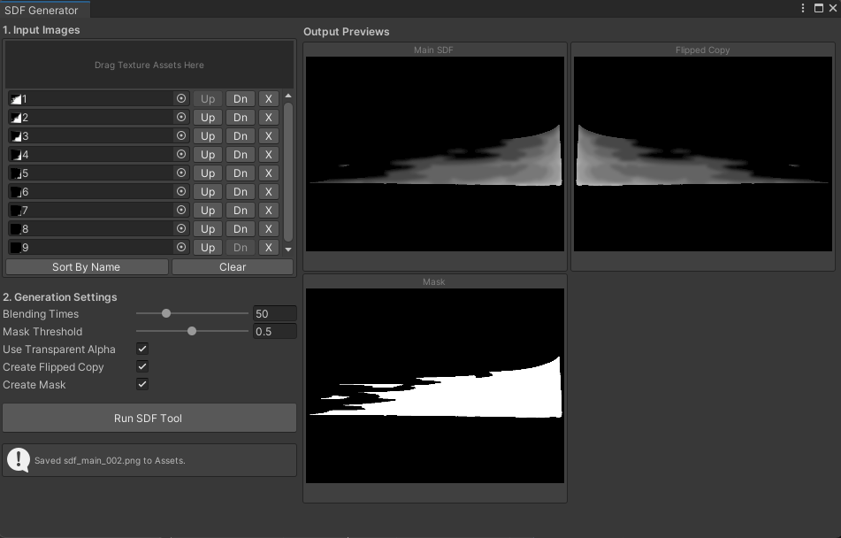

# SDF Generator

한 장 이상의 텍스처를 합쳐 흑백 SDF 이미지를 생성하는 도구입니다.

## 주요 기능

- 여러 입력 텍스처를 드래그 앤 드롭으로 등록
- 이름순 정렬과 입력 순서 변경
- 블렌딩 횟수와 마스크 기준값 조절
- 알파 채널 또는 밝기 값을 입력으로 사용
- 좌우 반전본과 마스크 이미지 선택 생성

## 사용법

1. `Tools > RoofTop Studio > SDF Generator`를 엽니다.
2. Project 창의 텍스처를 `Input Images` 영역에 드롭합니다.
3. 옵션을 조절하고 `Run SDF Tool`을 누릅니다.
4. 생성 결과를 오른쪽 프리뷰에서 확인합니다.

결과는 `Assets` 폴더에 `sdf_main.png`, `sdf_flipped.png`, `sdf_mask.png` 이름으로 저장됩니다. 같은 이름이 있으면 번호가 자동으로 붙습니다.
