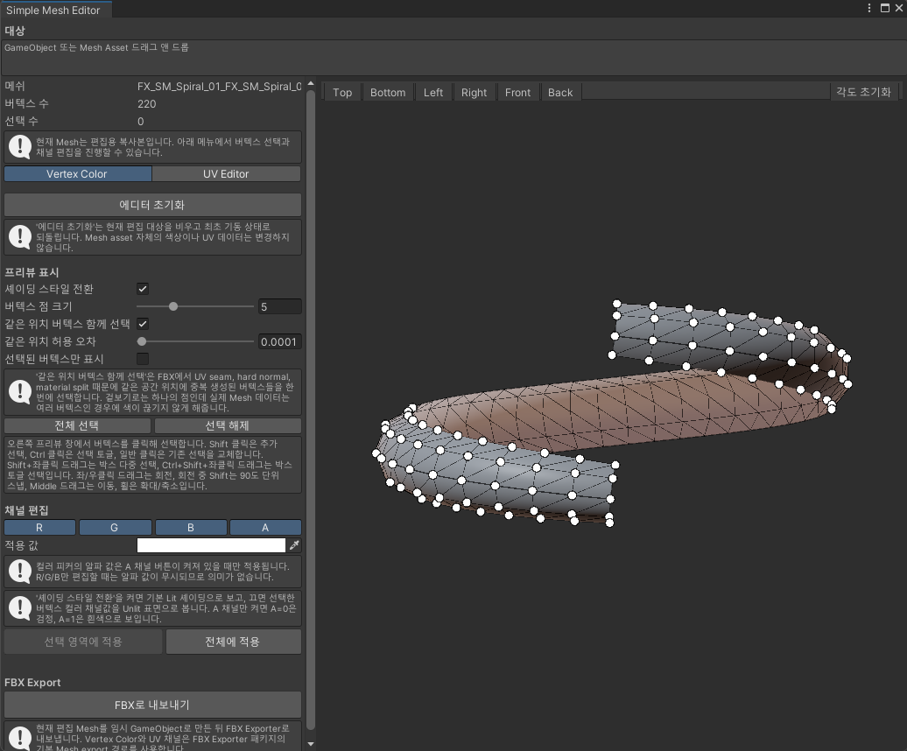

# Simple Mesh Editor

VFX용 Mesh의 Vertex Color와 UV를 Unity Editor 안에서 빠르게 수정하는 도구입니다.

## 주요 기능

- Mesh 또는 Mesh가 연결된 GameObject 드래그 앤 드롭
- 버텍스 클릭, 박스 선택, 같은 위치의 중복 버텍스 동시 선택
- 선택한 RGBA 채널에 Vertex Color 적용
- UV1/UV2 프리뷰, 복사, 90도 회전 및 반전
- 편집용 Mesh 복사본 생성
- 수정한 Mesh를 FBX로 출력

## 사용법

1. `Tools > RoofTop Studio > Simple Mesh Editor`를 엽니다.
2. Mesh Asset 또는 GameObject를 창에 드롭합니다.
3. `편집 시작: 복사본 생성`을 눌러 원본과 분리된 Mesh를 만듭니다.
4. 오른쪽 프리뷰에서 버텍스를 선택한 뒤 Vertex Color 또는 UV를 편집합니다.
5. 필요하면 `FBX로 내보내기`로 결과를 저장합니다.

편집용 Mesh는 `Assets/VFXMeshEdited`, FBX는 `Assets/VFXMeshExported`에 저장됩니다.

## 요구 사항

- Unity FBX Exporter (`com.unity.formats.fbx`)
- Universal Render Pipeline
