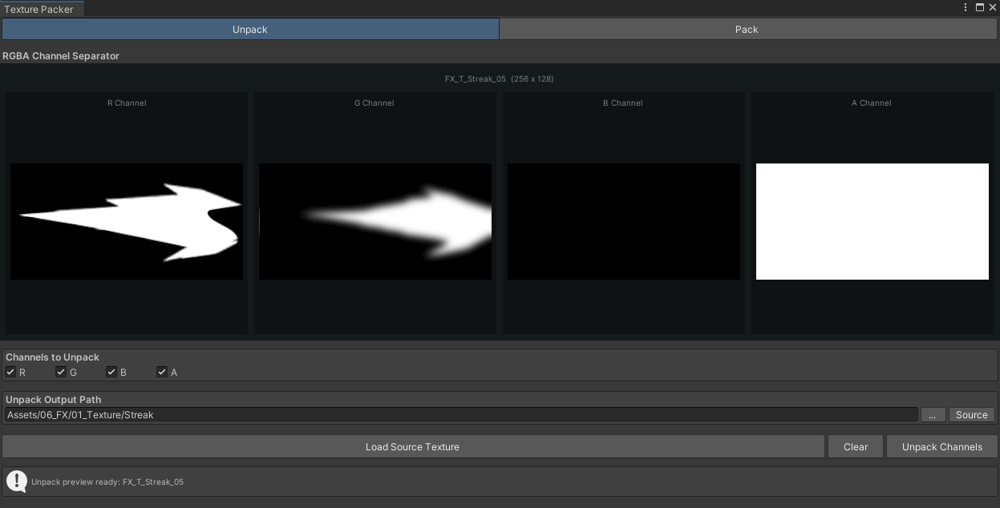

# Texture Packer

텍스처의 RGBA 채널을 개별 이미지로 분리하거나 여러 흑백 이미지를 한 장의 채널 텍스처로 합치는 도구입니다.

## 주요 기능

- RGBA 채널별 프리뷰와 PNG 분리 저장
- 최대 네 장의 입력 텍스처를 RGBA 채널로 패킹
- 서로 다른 입력 크기를 기준 크기에 맞춰 처리
- 저장 폴더와 파일 이름 지정

## 채널 분리

1. `Tools > RoofTop Studio > Texture Packer`을 엽니다.
2. `Unpack` 탭에 텍스처를 드롭합니다.
3. 필요한 채널과 저장 위치를 선택합니다.
4. `Unpack Channels`를 누릅니다.

## 채널 패킹

1. `Pack` 탭의 R, G, B, A 슬롯에 텍스처를 넣습니다.
2. `Generate Preview`로 결과를 확인합니다.
3. 파일 이름과 저장 위치를 정한 뒤 `Pack Texture`를 누릅니다.

결과 파일은 PNG 형식으로 저장됩니다.
